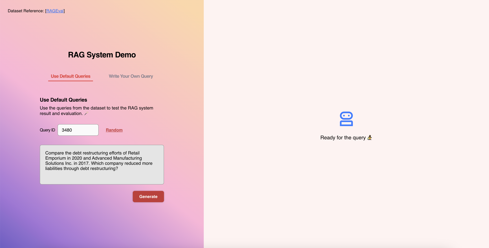

# WSM Final Project - Build A RAG System (Renewed Version)
## Project Overview

This is the renewed version of the final project of Web Search and Mining class in NCCU, Fall 2025.
For the original project and RAG details, please refer to [Original Project](https://github.com/uniyeh/WSM-Final-Project-2025-WSM-RAG-Cup).

### What are the new implemetations in this Renewed Version? 
- Add an **interaction frontend page** to demonstrate the retrieval progress.
- Optimise retrival and LLM evaluation scores (TBD).

### The Interaction Page
</img>

#### Choose how you want to interact with the RAG system:
##### 1. Use Default Queries
Run predefined queries from the dataset to test the RAG pipeline. The system will automatically evaluate its generated answers against the dataset's ground-truth references.
##### 2. Write Your Own Query
Ask custom questions to test the system's live retrieval and generation capabilities, allowing you to manually verify the results.

## Acknowledgement
- We refer to the [RAGEval](https://github.com/OpenBMB/RAGEval) for the dataset and evaluation.
- For dense retrival, we refer to the [FAISS](https://github.com/facebookresearch/faiss) for the implementation.
